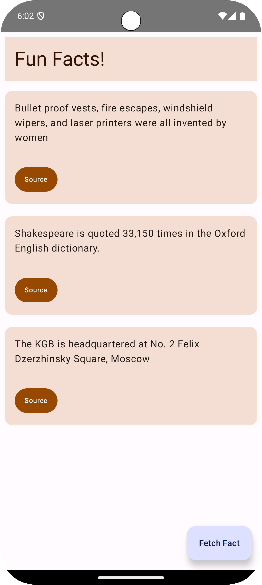

# 🎉 FunFacts – A Simple Android App

## 📱 Overview

FunFacts is a lightweight Android application that presents users with random fun facts. Built with Kotlin, it pulls from a database full of fun facts.  

## 🖼️ Screenshot



## 🎯 Project Objectives

- Develop a simple Android app using Kotlin.
- Implement a user interface that displays random fun facts.
- Enhance understanding of Android app development fundamentals.

## 🛠️ Technologies Used

- **Programming Language:** Kotlin  
- **Platform:** Android  
- **Development Environment:** Android Studio  

## 🧠 Key Learnings

- **UI Development:** Gained experience in creating user interfaces with Kotlin for Android.
- **Randomization:** Implemented functionality to display random facts upon user interaction.
- **App Lifecycle:** Learned about the Android activity lifecycle and how to manage app states.

## 🚀 Getting Started

1. **Clone the repository:**

    ```bash
    git clone https://github.com/landonwest815/FunFacts.git
    ```

2. **Open in Android Studio:**
    - Navigate to `File` > `Open` and select the cloned repository folder.

3. **Build and Run:**
    - Connect an Android device or start an emulator.
    - Click the `Run` button to build and launch the application.
